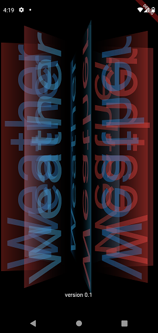
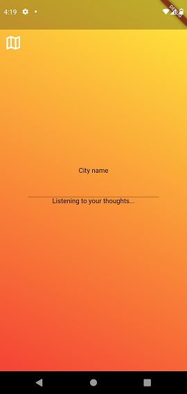
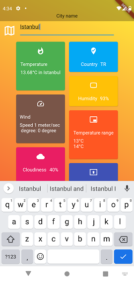
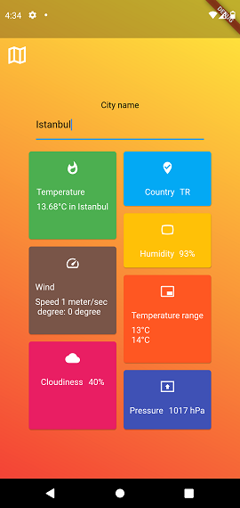
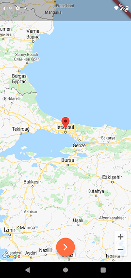

# Weather Forecast
A sample **Flutter** application by Seyed Abbas Ghomi.


### Used Libraries: 

- [MobX](https://pub.flutter-io.cn/packages/mobx) 

- [Provider](https://pub.flutter-io.cn/packages/provider)

- [Http](https://pub.flutter-io.cn/packages/http)

- [Beamer](https://pub.dev/packages/beamer)

- [Equatable](https://pub.flutter-io.cn/packages/equatable)

- [Google_maps_flutter](https://pub.flutter-io.cn/packages/google_maps_flutter)

- [Flutter_staggered_grid_view](https://pub.dev/packages/flutter_staggered_grid_view)

  

### Notes

Please pay attention to the settings below in order to app work properly:

- https://openweathermap.org/

  please register on this website and obtain your API key, you should use your API key in the addresses below to authorize the app to fetch weather data 

  (you can use the free version)

    ```
    [project folder]\lib\common\constants\static_values.dart
    static const String openWeatherApiKey = "OpenWeather_API_KEY";
    ```

- https://pub.flutter-io.cn/packages/google_maps_flutter
  
  Please use the tutorial on the package page and learn how to obtain the Google API Key, use your API key in the addresses below to authorize the app to use Google Map 
  
  ```xml-dtd
  [project folder]\android\app\src\main\AndroidManifest.xml
    <meta-data android:name="com.google.android.geo.API_KEY" android:value="Google_API_KEY"/>
  ```

  ```swift
  [project folder]\ios\Runner\AppDelegate.swift
    GMSServices.provideAPIKey("Google_API_KEY")
  ```


### Screen shots












## Getting Started

This project is a starting point for a Flutter application.

A few resources to get you started if this is your first Flutter project:

- [Lab: Write your first Flutter app](https://flutter.dev/docs/get-started/codelab)
- [Cookbook: Useful Flutter samples](https://flutter.dev/docs/cookbook)

For help getting started with Flutter, view our
[online documentation](https://flutter.dev/docs), which offers tutorials,
samples, guidance on mobile development, and a full API reference.
